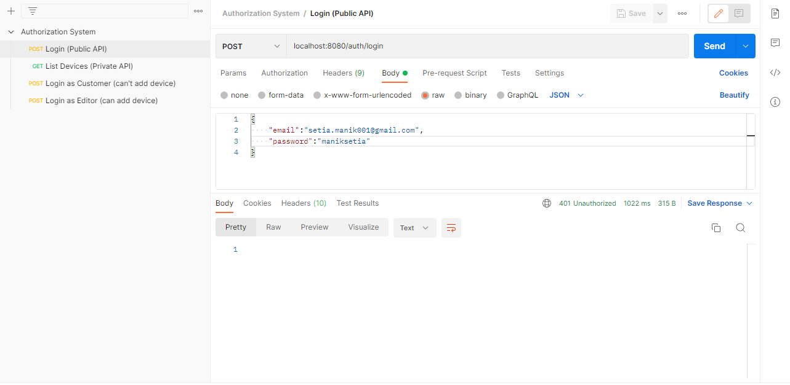

# Permission-Based-Authorization-System
This is a project consisting of authorization system for different APIs.

---

**Tools and Technologies used are:**
1) Spring Boot, JWT
2) MySQL
3) Postman
4) IntelliJ IDEA

**Tables in the database are as follows:**

1) Devices table (used for storing different devices)

2) Users table (used for storing different users)

3) Roles table (used for defining roles of different users)

4) User_roles table (Associative table, to eliminate Many-to-Many relationship between Users and Roles tables)

## The project consists of:
1) Public API
2) Private API

The **public API (/auth/login)** is accessible to everyone for login purpose. If the user has entered correct credentials then a token will be received. This token will be used to access the **private API**.

If the user failed to enter the correct credentials then Http status "401 Unauthorized" will be sent to the client as shown below.

If the user tries to access **private API (/devices)** without adding the received access token, then Http status "401 Unauthorized" will be received at the client side.

On the other side, if accessed the **private API (/devices)** using access token then the list of devices will be shown which are present in the database.

NOTE: Authenticated users can access the **private API (/devices)** to get the list of devices, however, not all of the authenticated users can add a device into the database. There comes **Role** into the picture. 
The defined roles in the project are:
1) ADMIN
2) EDITOR
3) CUSTOMER

The user with role **Editor** can only add a device into the database. If the **Customer** tries to do so, "403 Forbidden" Http status will be received.

Case 1: When an user with role **Editor** adds a device.

Case 2: When an user with role **Customer** adds a device.

---
